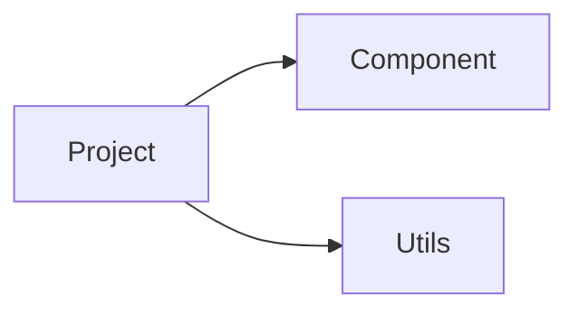

# neo-component

## The project used to learn the project structure and npm publish.

```mermaid
graph LR
  component[Component]
  util[Utils]
  project[Project]
  project-->component
  project-->util
```
